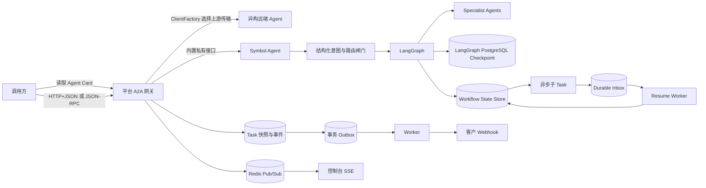
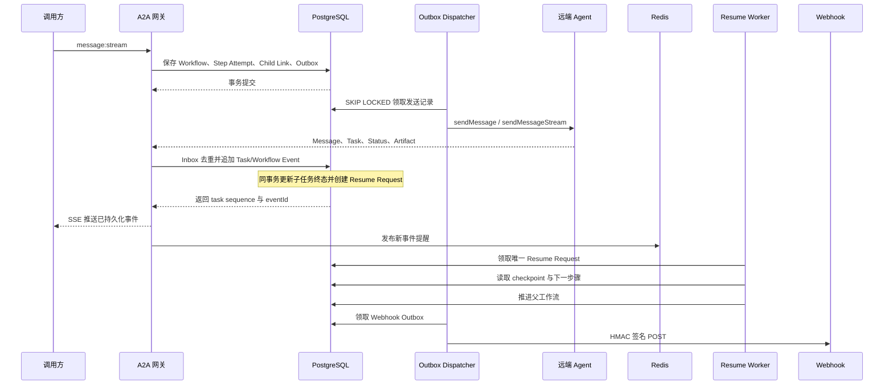
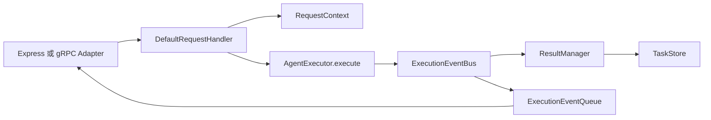
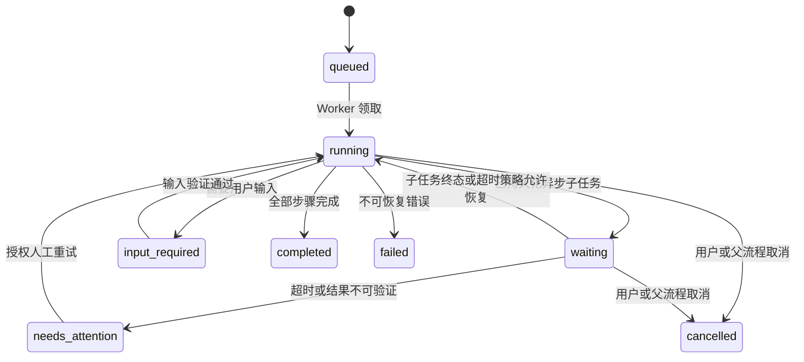
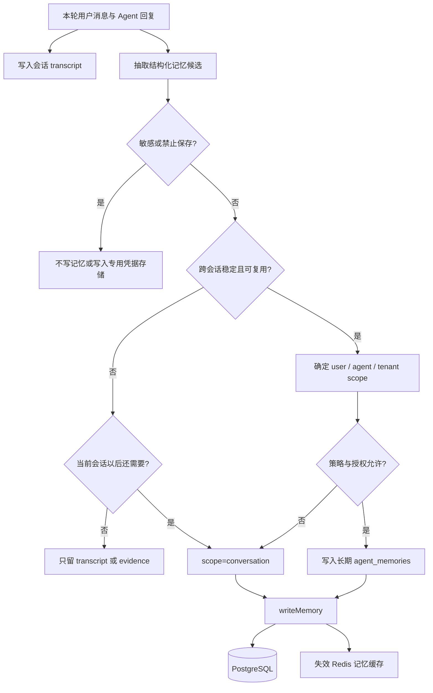

# A2A Agent Platform：27 个 Agent、协议与持久化问题

> 回答基线：2026-09-16 当前工作树，Git `main` 的 HEAD 为 `813b4cd`。项目实际安装 `@a2a-js/sdk@1.0.1`、`@langchain/langgraph@1.4.12`、`@langchain/langgraph-checkpoint-postgres@1.0.5`。运行代码和 `specs/003-durable-workflows` 定义的完整架构都属于回答依据。后者当前是 Draft，本文按该规格的目标架构说明数据模型、状态转换、事务边界、恢复和异常处理。

这份材料按面试回答来组织。每题先给出一段可以直接口述的“面试短答”，再展开实现机制、取舍和项目落点。面试时不必背源码路径；先说明判断和方案，面试官追问“你们项目怎么做”时，再用项目实现作证据。

## 先看清三层边界

这个项目同时涉及协议、平台和 Agent 内部编排。三者处理的问题不同：

| 层级             | 解决的问题                                                                            | 本项目中的载体                                                |
| ---------------- | ------------------------------------------------------------------------------------- | ------------------------------------------------------------- |
| A2A 协议层       | 不同组织、语言和框架实现的 Agent 如何互相发现、调用、流式返回、查询和取消任务         | Agent Card、Message、Task、Artifact、HTTP+JSON、JSON-RPC、SSE |
| 平台控制面与网关 | 如何统一鉴权、租户隔离、限流、实例路由、任务观测、事件广播、Webhook、工作流恢复和审计 | Express 网关、PostgreSQL、Redis、Outbox、Inbox、Resume Worker |
| Agent 内部执行层 | 一个具体 Agent 如何识别意图、拆任务、调用工具、组合 specialist、保存运行状态          | Symbol Agent、LangGraph、PostgresSaver、记忆服务              |

A2A 不规定模型如何推理，也不替应用决定使用 LangGraph、AutoGen 或手写状态机。它规定的是 Agent 边界外可互操作的对象、方法、状态和传输方式。



## 1. 什么是异构 Agent

**面试短答：** 异构 Agent 是指语言、框架、模型、工具、部署方式或所属组织不同，但仍要协作的 Agent。平台不会强迫它们使用同一套内部实现，而是用 Agent Card 描述能力，用 A2A 统一消息、任务、状态和产物，再通过传输适配器屏蔽 HTTP+JSON、JSON-RPC 等差异。

异构 Agent 指内部实现并不相同，但需要在同一系统里协作或被统一调用的 Agent。差异可能来自：

- 编程语言和运行环境不同，比如 TypeScript、Python、Java 或独立 SaaS。
- 框架不同，比如 LangGraph、AutoGen、CrewAI、Semantic Kernel，或者完全手写。
- 模型、工具、记忆和推理方式不同。
- 部署位置不同，可以在同一进程、不同容器、不同集群，甚至不同组织。
- 鉴权方式、支持的传输、输入输出媒体类型和生命周期能力不同。

本项目不会接管远端 Agent 的进程。它注册远端 Agent Card，选出兼容的 `JSONRPC` 或 `HTTP+JSON` 接口，再向客户暴露统一的 A2A 1.0 地址和平台 API Key 鉴权。异构性被限制在网关之后，调用方只面对统一的 Agent Card、Task 和事件模型。相关实现见 [agent-service.ts](../apps/platform-api/src/agent-service.ts#L183) 和 [README.md](../README.md#L1)。

## 2. Agent 协作的方式有哪些

**面试短答：** 常见方式有顺序流水线、并行分治、Supervisor-Specialist、Handoff、辩论反思、共享黑板和事件驱动协作。选择时主要看任务是否有依赖、是否需要统一决策者、结果能否独立验证，以及任务是否会跨连接或跨进程运行。本项目的核心模式是确定性的 Supervisor-Specialist 流水线。

常见协作方式可以按控制权和数据流划分：

| 方式                  | 工作方式                                       | 适用场景                       | 主要风险                      |
| --------------------- | ---------------------------------------------- | ------------------------------ | ----------------------------- |
| 顺序流水线            | A 的结构化输出成为 B 的输入                    | 分析、生成、审核等固定步骤     | 上游错误逐步放大              |
| 并行分解再汇总        | 多个 Agent 独立处理子问题，最后合并            | 可拆分研究、低耦合工具调用     | 合并冲突、重复成本            |
| Supervisor-Specialist | Supervisor 决定调用哪些专家并生成最终答复      | 需要一个统一责任主体的复杂任务 | Supervisor 成为质量与吞吐中心 |
| Handoff               | 当前 Agent 把会话控制权交给另一个 Agent        | 客服分流、升级、专业领域接管   | 上下文和权限在交接处丢失      |
| 群聊、辩论与反思      | 多 Agent 轮流提出、批评和修订                  | 开放式探索、评审               | 回合膨胀，错误可能形成共识    |
| Blackboard            | Agent 通过共享状态或工件协作                   | 多阶段规划、跨专业证据积累     | 并发写冲突和数据污染          |
| 事件驱动异步协作      | 发出子任务后释放执行资源，由完成事件唤醒父流程 | 长任务、跨组织 Agent、人工审批 | 重复、乱序、丢事件和恢复竞态  |

当前 Symbol Supervisor 使用 Supervisor-Specialist 加顺序流水线。六个 specialist 固定按市场、公司、技术与期权、新闻、风险、观点审查执行，Supervisor 最后汇总。代码没有并行 fan-out，也没有自由群聊，见 [symbol-graph.ts](../apps/platform-api/src/symbol-graph.ts#L30)。

## 3. A2A 是什么

**面试短答：** A2A 是 Agent 之间的互操作协议，解决“怎么发现对方能力、怎么发消息、怎么跟踪长任务、怎么接收状态和产物”这类边界问题。它不规定 Agent 内部怎么推理。MCP 更偏向 Agent 调工具，A2A 更偏向 Agent 调 Agent，两者是互补关系。

A2A 是 Agent2Agent 协议。它让一个 Agent 客户端先读取另一个 Agent 的能力声明，再通过标准方法发送消息、获得 Task、接收进度和产物，并在需要时查询、订阅或取消 Task。

一条典型链路是：

1. 客户端读取 `/.well-known/agent-card.json`。
2. 根据 `supportedInterfaces` 选择双方都支持的协议绑定。
3. 发送 `Message`。服务端可以直接返回一条 `Message`，也可以创建 `Task`。
4. 长任务通过状态更新和 Artifact 持续产出结果。
5. 客户端用查询、SSE 重订阅或 Push Notification 继续观察任务。

A2A 适合跨服务、跨团队和跨技术栈协作。MCP 更偏向 Agent 如何调用工具或上下文服务，两者可以同时存在：Agent 内部通过 MCP 用工具，Agent 对外通过 A2A 接受另一个 Agent 的任务。

## 4. A2A 1.0 协议简介

**面试短答：** A2A 1.0 可以用“一个能力入口、四类核心对象、两种交互形态”来理解：Agent Card 是能力入口；Message、Task、Artifact 和事件是核心对象；交互既可以同步请求响应，也可以用 SSE 或 Push Notification 处理长任务。主要操作包括发送、查询、取消和订阅任务。

A2A 1.0 的核心对象包括：

- `AgentCard`：名称、版本、说明、技能、能力、接口、认证方案和扩展。
- `AgentInterface`：接口 URL、`protocolBinding`、`protocolVersion` 和可选 tenant。
- `Message`：角色、消息 ID、`taskId`、`contextId`、Parts、引用任务和 metadata。
- `Part`：文本、文件或结构化数据等内容单元。
- `Task`：任务 ID、上下文 ID、当前 `TaskStatus`、历史消息、Artifacts 和 metadata。
- `Artifact`：任务产出的文档、数据、图片或其他结构化结果，可以分片追加。
- `TaskStatusUpdateEvent` 与 `TaskArtifactUpdateEvent`：流式状态和工件更新。

本项目所用 SDK 1.0.1 定义了这些 Task 状态：

| 状态                        | 含义             | 是否终态         |
| --------------------------- | ---------------- | ---------------- |
| `TASK_STATE_SUBMITTED`      | 已接收等待处理   | 否               |
| `TASK_STATE_WORKING`        | 正在执行         | 否               |
| `TASK_STATE_INPUT_REQUIRED` | 等待用户补充信息 | 否，属于中断状态 |
| `TASK_STATE_AUTH_REQUIRED`  | 等待认证         | 否，属于中断状态 |
| `TASK_STATE_COMPLETED`      | 成功完成         | 是               |
| `TASK_STATE_FAILED`         | 执行失败         | 是               |
| `TASK_STATE_CANCELED`       | 已取消           | 是               |
| `TASK_STATE_REJECTED`       | Agent 拒绝执行   | 是               |

主要方法包括 `SendMessage`、`SendStreamingMessage`、`GetTask`、`ListTasks`、`CancelTask`、`SubscribeToTask`，以及 Task Push Notification Config 的创建、查询、列表和删除。协议还覆盖版本协商、扩展、认证声明、Agent Card 签名和多种传输绑定。

本项目向客户暴露 HTTP+JSON 和 JSON-RPC 两套 1.0 接口。SDK 还支持 gRPC，但平台网关当前没有把 gRPC 暴露给客户。项目协议面见 [openapi.yaml](../docs/openapi.yaml#L1)，SDK 版本见 [apps/platform-api/package.json](../apps/platform-api/package.json#L1)。

## 5. Agent 之间有哪些通信方式

**面试短答：** Agent 通信不能只回答 HTTP。按时效性可以分为同步请求、SSE 流式返回、轮询或重订阅、Webhook 回调和消息队列；按协作方式还可以通过共享状态或工件间接通信。本项目用 SSE 解决实时体验，用 PostgreSQL 状态和 Outbox 解决可靠性，用 Redis Pub/Sub 解决跨实例低延迟通知。

需要把线上的 A2A 通信和服务内部通信分开：

- 同步请求响应：`message:send`，适合很快完成或能立即返回 Task 的请求。
- 流式调用：`message:stream`，服务端用 SSE 持续推送 Message、Task、Status 和 Artifact 事件。
- Task 查询：通过 `GetTask` 轮询权威 Task 状态。
- Task 重订阅：已有 `taskId` 后使用 `SubscribeToTask` 重新建立事件流。
- Push Notification：客户端无法维持长连接时，Agent 把任务更新 POST 到已登记的回调地址。
- 内部事件总线：同一 Agent 进程中，执行器把事件发给 EventBus，由传输适配器消费。
- 消息队列或事件流：跨服务异步传递，常用 Kafka、RabbitMQ、NATS、SQS、Redis Streams 等。当前项目没有使用这些持久队列。
- 共享持久化状态：Agent 不直接对话，而是读写同一工作流状态、工件或黑板。

当前项目对外主要使用 HTTP+JSON、JSON-RPC 和 SSE；控制台跨 API 实例的实时通知使用 Redis Pub/Sub；可靠 Webhook 创建使用 PostgreSQL Outbox。

## 6. 长任务管理与事件分发怎么实现

**面试短答：** 核心是把任务生命周期从 HTTP 连接和单个进程中解耦。接到请求后先生成 `taskId` 并持久化任务状态与事件，执行过程中通过 SSE 和 Redis 做实时分发，通过 Outbox 和 Webhook 做可靠通知；连接断开后任务继续运行，客户端可以用任务查询、重订阅或事件游标恢复观察。

长任务由两层状态机共同管理。A2A `Task` 描述一次对外可见的 Agent 任务，负责 `submitted`、`working`、`input_required`、`completed` 等协议状态；`Workflow Instance` 描述平台内部的业务流程，负责当前步骤、等待对象、下一步骤、重试、恢复和人工介入。一个工作流可以关联多个 A2A Task，一个 A2A Task 也能作为某个步骤尝试的外部子任务。

工作流状态包括 `queued`、`running`、`waiting`、`input_required`、`completed`、`failed`、`cancelled` 和 `needs_attention`。每次执行步骤都会生成独立的 `Step Attempt`，异步调用则生成 `Child Task Link`，把父工作流、步骤尝试、远端 Agent、`taskId`、等待期限和终态关联在一起。父 Agent 发出子任务后进入 `waiting` 并释放执行资源，不需要让一个进程或 HTTP 连接一直挂着。

完整的事件链路如下：



事件会进入三条用途不同的通道：

- PostgreSQL 事件表保存不可变时间线和重放游标，是审计与恢复依据。
- Redis Pub/Sub 通知各 API 实例有新事件，用于低延迟刷新，不承担历史保存。
- 事务 Outbox 负责 Webhook 和子任务派发，Worker 可重试，接收方按 `eventId` 或幂等键去重。

面试官继续问异常场景时，可以按下面这张表回答：

| 异常场景                         | 系统怎么处理                                                                  |
| -------------------------------- | ----------------------------------------------------------------------------- |
| 客户端或 SSE 连接断开            | 不取消 Task；客户端用 `taskId` 查询或携带最后序号重订阅                       |
| API 在事务提交后、实际派发前崩溃 | Outbox 仍保留待发送记录，其他 Dispatcher 接手                                 |
| 同一回调或终态重复到达           | Inbox 唯一键去重；已完成的步骤不再次推进                                      |
| Redis 暂时不可用                 | 失去实时提醒但不丢事实；恢复后从 PostgreSQL 事件游标补放                      |
| 子 Agent 超时或失联              | 根据步骤策略重试、失败、切换实例，或进入 `needs_attention`                    |
| 用户取消任务                     | 先持久化取消状态，再尽力向子 Task 传播；迟到结果只记审计，不重新唤醒父流程    |
| 服务实例重启                     | 启动扫描未完成工作流、过期租约、待处理 Outbox 和 Resume Request，重新领取执行 |

远端 Agent 的 TaskStore 仍是协议任务的权威来源，平台的 `task_snapshots` 是观测快照，Workflow State Store 则是父流程恢复的权威来源。查询、取消和重订阅远端 Task 时使用远端状态；决定父流程从哪个步骤继续时使用工作流实例、步骤尝试、子任务关联和 checkpoint。

网关现有的 Task 事件写入由 [gateway-router.ts](../apps/platform-api/src/gateway-router.ts#L668) 和 [task-service.ts](../apps/platform-api/src/task-service.ts#L317) 完成；父子任务、恢复请求和异常策略按 [003-durable-workflows/spec.md](../specs/003-durable-workflows/spec.md#L1) 定义。可靠链路采用“先保存现场和待发送记录，再执行外部副作用”的事务顺序，进程退出或客户端断线不会丢失父流程的恢复位置。

## 7. 怎么屏蔽不同 Agent 的实现差异，Agent 又有哪些实现方式

**面试短答：** 对外靠协议契约和 Agent Card，对内靠统一的 Task、Message、Artifact 模型与传输适配器。平台只依赖能力、输入输出和生命周期，不依赖 Agent 是 ReAct、工具调用、固定工作流、Planner-Executor、Supervisor 多 Agent，还是人工参与的状态机。

屏蔽差异依赖协议适配，不依赖要求所有 Agent 使用同一个框架：

1. Agent Card 描述能力、技能、接口版本和认证要求。
2. 注册时校验 Card，并从 `supportedInterfaces` 中选出平台支持的接口。
3. `ClientFactory` 按选中的绑定创建统一 `Client`，上层只调用 `sendMessage`、`sendMessageStream`、`getTask`、`cancelTask` 等接口。
4. 网关统一补租户、鉴权、超时、响应大小限制、实例租约、配额和审计。
5. 上游事件统一转换成 A2A `StreamResponse`，再进入 Task 快照、Redis 和 SSE。

Agent 内部可以采用很多实现：纯规则状态机、单模型工具调用、ReAct、Planner-Executor、LangGraph 状态图、Supervisor-Specialist、多 Agent 群聊、RAG Agent、代码执行 Agent、人机协同流程，或者已有业务服务套一层 A2A Adapter。只要对外满足 Card、方法、对象和状态契约，平台不需要知道其内部结构。

当前平台只接受 Card 中的 `JSONRPC` 或 `HTTP+JSON` 上游接口。它会保存所选接口和 Card 修订；平台代理 Card 则统一改写成平台地址与 `X-API-Key` 安全方案，见 [agent-service.ts](../apps/platform-api/src/agent-service.ts#L276)。

## 8. HTTP+JSON、JSON-RPC、SSE 有什么区别

**面试短答：** HTTP+JSON 和 JSON-RPC 解决“调用怎么表达”，SSE 解决“服务器如何在一条 HTTP 连接上持续推事件”，所以它们不是同一层的三个替代方案。JSON-RPC 有统一 envelope 和 method/id/error；HTTP+JSON 更贴近资源和路由；SSE 可以承载前两种调用产生的连续结果，但本身不是完整的 RPC 语义。

它们不完全处在同一层。HTTP+JSON 和 JSON-RPC 是调用绑定，SSE 是 HTTP 上的单向流式承载方式。

| 维度     | HTTP+JSON                         | JSON-RPC 2.0                                        | SSE                                                           |
| -------- | --------------------------------- | --------------------------------------------------- | ------------------------------------------------------------- |
| 核心作用 | 用资源化 URL 和 HTTP 动词表达操作 | 用统一端点、`method`、`params`、`id` 表达远程调用   | 在一条 HTTP 响应上连续推送事件                                |
| 请求示例 | `POST /message:stream`            | `POST /a2a/jsonrpc`，方法为 `SendStreamingMessage`  | `Content-Type: text/event-stream`                             |
| 响应     | 普通 JSON 或 SSE                  | JSON-RPC result/error，流式方法可把 result 放进 SSE | 多个 `event:` / `data:` block                                 |
| 错误语义 | HTTP 状态码加业务错误体           | JSON-RPC error code/message/data                    | 建连前可用 HTTP 错误，建连后通常发送 error event              |
| 双向性   | 一次请求一次响应                  | 一次 RPC 请求一次结果                               | 服务器到客户端单向持续推送                                    |
| 重连     | 应用自己再次请求                  | 应用再次发 RPC                                      | 浏览器 EventSource 可自动重连，但 POST SSE 通常要应用自行重连 |

项目的 REST 流式路径和 JSON-RPC 流式方法都会用 SDK 的 `formatSSEEvent` 输出。SSE 本身不提供业务幂等、任务恢复或可靠消息队列语义；这些要靠 `taskId`、事件序号、持久化和重订阅补齐。

## 9. a2a.js/sdk 的实现主要有什么

**面试短答：** `a2a.js/sdk` 主要分四块：协议类型与序列化、客户端及传输选择、服务端请求处理与执行器、Task 存储和事件总线。典型调用链是客户端根据 Agent Card 选择传输，服务端 Handler 校验请求并调用 `AgentExecutor`，执行器把状态和产物写入事件队列与 TaskStore，再由传输层返回或流式推送。

本项目实际安装的 `@a2a-js/sdk@1.0.1` 是 A2A 1.0 的 TypeScript/JavaScript 客户端和服务端 SDK，不是一个具体 Agent。

主要模块包括：

- 核心协议类型：AgentCard、Message、Task、Artifact、Part、状态和请求响应类型。
- 客户端：`ClientFactory`、统一 `Client`、Agent Card Resolver、调用拦截器和认证 fetch。
- 客户端传输：JSON-RPC、HTTP+JSON，gRPC 在 Node 专用子模块中。
- 服务端：`AgentExecutor`、`DefaultRequestHandler`、`RequestContext`、`ExecutionEventBus`、`ExecutionEventQueue`、`ResultManager`、`TaskStore`。
- Express Adapter：`jsonRpcHandler`、`restHandler`、Agent Card handler。
- gRPC 服务端和客户端 Adapter。
- Push Notification Store 与 Sender。
- Agent Card JWS 签名和校验。
- A2A Extensions 与请求拦截能力。
- 可选的 v0.3 兼容层。

服务端典型调用链是：



本项目网关端直接使用 `ClientFactory`、`JsonRpcTransportFactory` 和 `RestTransportFactory`。内置 Symbol Agent 使用 SDK 的协议类型和 SSE 工具手写了兼容路由，没有使用 `DefaultRequestHandler + AgentExecutor` 这一套服务端骨架，见 [symbol-router.ts](../apps/platform-api/src/symbol-router.ts#L1)。

## 10. long-running Task 指什么

**面试短答：** Long-running Task 不是简单的“函数执行得慢”，而是任务生命周期可能长于一次请求、一个连接甚至一个服务实例。它必须有稳定的 `taskId`、可持久化状态、查询与取消能力、断线重连、幂等处理，以及在进程重启后继续或安全重试的机制。

Long-running Task 指生命周期可能超过一次普通 HTTP 请求、一次模型调用或一个执行实例存活时间的任务。它不由固定的秒数定义，关键特征是：

- 调用方不能一直同步阻塞等待结果。
- 中间会有状态、增量结果或人工输入。
- 网络断开后任务仍可能继续。
- 任务可能跨重试、进程重启、扩缩容或第三方回调。
- 必须能够通过稳定 `taskId` 查询、取消、订阅和审计。

本项目网关单次 A2A 调用默认受 `MAX_A2A_CALL_DURATION_MS=300000` 限制，所以保持同一上游流的时间上限默认是 5 分钟。真正超过连接寿命的任务应由远端 Agent 持久化，并通过 `GetTask`、`SubscribeToTask` 或 Push Notification 继续。不能把一个长时间不关闭的 SSE 连接等同于已经具备可恢复长任务能力。

## 11. 可恢复的异步通信链路怎么设计

**面试短答：** 可恢复链路的关键不是保住原来的连接，而是保住可重建的状态。外部调用前保存工作流和等待关系，回调进入 Durable Inbox 并按事件 ID 去重，再创建唯一的恢复请求；Resume Worker 通过租约或锁抢占恢复权，从 checkpoint 和业务状态重建上下文，继续未完成步骤。

恢复能力来自持久状态，不依赖原来的请求连接或执行进程。链路使用六类核心记录：

| 记录              | 保存内容                                                        | 恢复时的作用                 |
| ----------------- | --------------------------------------------------------------- | ---------------------------- |
| Workflow Instance | 租户、定义版本、当前状态、当前与下一步骤、受控上下文、版本号    | 判断整条流程从哪里继续       |
| Step Attempt      | 步骤 ID、尝试号、输入摘要、状态、开始与结束时间、错误和副作用键 | 区分重试，避免覆盖旧失败记录 |
| Child Task Link   | 父工作流、步骤尝试、Agent、远端 `taskId`、等待期限、终态        | 把异步结果准确送回父流程     |
| Durable Inbox     | 来源、`eventId`、租户、原始摘要、验证结果和处理状态             | 对重复、迟到和非法回调去重   |
| Resume Request    | 触发原因、目标工作流、可执行时间、领取者、租约和处理结果        | 让任意健康实例安全接手       |
| Workflow Event    | 单调序号、状态变化、操作者、原因和脱敏载荷                      | 审计、时间线与客户端重放     |

链路分成三个事务：

1. **调度事务**：锁定工作流，创建新的步骤尝试和子任务关联，把父流程改为 `waiting`，保存下一步骤与恢复上下文，同时写入发送 Outbox。事务提交后，Dispatcher 才向子 Agent 发请求。
2. **接收事务**：验证签名、事件源、租户和关联 ID；按 `(source, eventId)` 插入 Inbox。首次有效终态会更新 Child Task Link，把结果写入受控上下文，将父流程标为可恢复，并创建唯一 Resume Request。重复事件只补审计，不再推进状态。
3. **恢复事务**：Worker 用 `FOR UPDATE SKIP LOCKED` 或带过期时间的租约领取 Resume Request，检查工作流仍处于 `waiting` 或 `input_required`、定义版本仍有效且未被取消，然后加载 checkpoint，创建下一步尝试并把工作流改回 `running`。



几个竞态在数据层解决：子任务结果先于发送响应到达时，预先保存的 Child Task Link 仍能关联它；两个实例同时恢复时，只有一个能获得行锁或租约；工作流取消后到达的结果只写审计，不创建恢复请求；重试会创建新的 Step Attempt，不修改原失败尝试；工作流启动后固定 `definitionVersion`，定义升级不会改变正在运行的实例。

恢复点要按故障发生的位置设计，不能只写一个笼统的“失败后重试”：

| 故障位置                        | 恢复依据与动作                                                                  |
| ------------------------------- | ------------------------------------------------------------------------------- |
| 外部请求发送前进程退出          | 调度事务已经保存 Outbox，Dispatcher 重新派发                                    |
| 请求已发出但响应超时            | 使用相同幂等键查询或重试；不能直接创建第二个逻辑任务                            |
| 回调早于发送方记录响应          | 依靠发送前已保存的 Child Task Link 关联，而不是依赖内存中的 Promise             |
| 同一回调重复到达                | `(source, eventId)` 或业务幂等键命中，保留审计但不重复创建 Resume Request       |
| 两个 Worker 同时尝试恢复        | 行锁、`SKIP LOCKED` 或租约只允许一个 Worker 获得执行权                          |
| 取消后收到迟到结果              | 记录结果和来源，不从终态回退，也不继续后续副作用                                |
| 重启时发现长期 `waiting` 的流程 | 核对 deadline、子 Task 权威状态和恢复租约，随后重试、恢复或转 `needs_attention` |

Task 事件表、事务 Outbox、Webhook 重试、实例租约和 LangGraph `PostgresSaver` 为这套链路提供现成基础。`003-durable-workflows` 把父子任务、Inbox 和恢复请求补成完整闭环，并要求服务启动后扫描到期等待、过期租约和待处理事件。验收口径包括：可恢复流程在实例重启后 60 秒内恢复或进入 `needs_attention`；同一完成通知重复投递 100 次，后续步骤仍只执行一次。

## 12. 事务 Outbox 的作用是什么

**面试短答：** Outbox 用来解决“数据库提交成功，但消息没发出去”或相反的双写问题。业务状态和待发送事件在同一个数据库事务中提交，后台 Dispatcher 再投递并重试，因此保证至少一次发送；接收方还要用事件 ID 或业务幂等键去重，不能把至少一次误解成恰好一次。

数据库更新和发消息是两个独立系统，无法直接放进一个普通本地事务。典型失败是数据库已经提交，但进程在发 Webhook 前崩溃；或者消息已经发出，数据库回滚。Outbox 把准备发送的事件先作为同一数据库事务中的一行保存下来，让 Worker 以后投递。

本项目在 `appendTaskEvent` 的一个 PostgreSQL 事务中完成三件事：更新 `task_snapshots`、插入 `task_events`、插入 `task_event_outbox`。Outbox 使用 `${taskId}:${sequence}:${eventType}` 作为唯一 `dedupe_key`。Worker 用 `FOR UPDATE SKIP LOCKED` 领取，处理超过 2 分钟的 `processing` 遗留行，失败后指数退避，最多 12 次后进入 `dead_letter`，见 [007_task_event_outbox.sql](../apps/platform-api/migrations/007_task_event_outbox.sql#L1) 和 [webhook-service.ts](../apps/platform-api/src/webhook-service.ts#L541)。

Outbox 保证数据库事实最终能够触发投递，不保证接收端只收到一次。接收方仍需按事件 ID 幂等处理。

## 13. 跨实例事件广播怎么实现

**面试短答：** 我会把 PostgreSQL 事件表作为权威日志，Redis Pub/Sub 作为跨 API 实例的实时唤醒通道，SSE 作为发给浏览器的最后一跳。Redis 丢消息不会破坏正确性，因为客户端重连后可以带游标从 PostgreSQL 补放；这就是“持久化负责可靠，Pub/Sub 负责低延迟”。

跨实例广播分为持久事件和实时提醒两层。写事件的 API 实例先在 PostgreSQL 事务中生成 `eventId` 和任务内单调 `sequence`，提交 Task 或 Workflow Event；提交成功后再发布 Redis 提醒。Redis 消息携带租户、Agent、Task、事件 ID 和序号，订阅实例先做租户过滤，再把事件写入对应的控制台 SSE 连接。

当前频道分为 `agent:{agentId}:events` 和 `platform:{tenantId}:events`。任意 API 实例上的 `/api/admin/events` 会创建 Redis duplicate connection，`pSubscribe` 这两类频道，并每 15 秒向浏览器写一次 heartbeat，见 [redis.ts](../apps/platform-api/src/redis.ts#L30) 和 [admin-router.ts](../apps/platform-api/src/admin-router.ts#L439)。

Redis Pub/Sub 只负责低延迟唤醒。浏览器重连时携带最后一个 event ID 或 sequence，API 先从 PostgreSQL 补发游标之后的事件，再转入实时订阅；如果实时消息出现序号空洞，也回查数据库补齐。这样，某个 API 实例宕机、订阅短暂断开或 Redis 丢掉一条提醒，都不会破坏事件历史。控制台现有实现可通过重新查询 PostgreSQL Task 时间线补齐，Workflow Event 则按同样的游标模型恢复。

## 14. task/status/artifact/message 事件怎么按任务顺序写入 PostgreSQL

**面试短答：** 每个任务使用独立的单调序号。在同一个事务里先按 `taskId` 获取事务级 advisory lock，再读取当前最大 `seq`、加一并插入事件，同时更新任务快照；数据库对 `(task_id, seq)` 建唯一约束。这样得到的是平台接收顺序，而不是声称能还原分布式世界里的绝对发生顺序。

`appendTaskEvent` 对每个事件执行以下事务：

1. 计算事件 JSON 的字节数。
2. 获取事务级 advisory lock：`pg_advisory_xact_lock(hashtext(tenantId:agentId), hashtext(remoteTaskId))`。
3. 按 `(tenant_id, agent_id, remote_task_id)` upsert `task_snapshots`，更新最新状态、事件、错误、实例绑定和完成时间。
4. 如果事件包含 Task Artifacts 或 Artifact Update，锁定快照行并按 `artifactId` 合并；`append=true` 时追加 parts。
5. 查询当前 Task 的 `max(sequence)+1`。
6. 插入 `task_events(task_snapshot_id, sequence, event_type, state, payload, payload_bytes)`。
7. 同事务插入对应生命周期 Outbox 行。
8. 提交后返回平台快照 ID 和序号。

`task_events` 还有 `UNIQUE(task_snapshot_id, sequence)` 约束。`for await` 循环让单个流的事件串行写入，advisory lock 则让不同 API 实例对同一个远端 Task 的写入也串行化。核心代码见 [task-service.ts](../apps/platform-api/src/task-service.ts#L317)，表结构见 [004_platform_operations.sql](../apps/platform-api/migrations/004_platform_operations.sql#L94)。

这套顺序是平台观察到的到达顺序，不一定等于远端内部真实发生顺序。A2A 事件本身没有由平台统一强制的全局序号；如果远端或网络发生乱序，还需要上游事件 ID、发生时间或协议扩展辅助判断。

## 15. PostgreSQL checkpoint 是什么功能

**面试短答：** 这里的 PostgreSQL Checkpoint 指 LangGraph `PostgresSaver` 保存某个 `thread_id` 的图状态、节点进度和中断点，让图在进程重启后继续。它解决的是“计算图从哪里恢复”；业务 Workflow Store 还要解决“为什么暂停、等待哪个外部任务、谁可以恢复”。Checkpoint 也不会自动保证外部副作用幂等。

这里的 checkpoint 指 LangGraph 在一个 `thread_id` 下保存的图状态快照，不是 PostgreSQL 的 WAL checkpoint。

`PostgresSaver` 会保存图的 channel values、channel versions、父 checkpoint 和 pending writes。再次用同一 `thread_id` 调用图时，LangGraph 可以读取已有状态，用于会话连续性、人工中断、故障恢复和状态回溯。项目为它单独创建 `langgraph_symbol` schema，`thread_id` 是 `${tenantId}:${agentSlug}:${taskId}`，见 [018_langgraph_schema.sql](../apps/platform-api/migrations/018_langgraph_schema.sql#L1) 和 [symbol-graph.ts](../apps/platform-api/src/symbol-graph.ts#L39)。

Checkpoint 不等于业务 Task 表：

- checkpoint 保存图执行所需的内部状态。
- `agent_runs` 和 `agent_run_events` 保存面向运营的运行状态、节点轨迹和工具结果摘要。
- `symbol_conversations` 保存用户可恢复的对话、意图、证据和最终结果。
- `task_snapshots` 保存网关观察到的 A2A Task。

恢复执行时，Resume Worker 先从 Workflow State Store 取得 `workflowId`、`definitionVersion`、当前步骤和 `graphThreadId`，再以同一个 `thread_id` 加载最新 checkpoint。普通故障从最后一个已提交 checkpoint 继续；`input_required` 场景把已验证的用户输入作为 resume payload 交给图；节点副作用则通过 Step Attempt 的幂等键检查是否已经成功，避免恢复时重复调用外部系统。

Checkpoint 和 Workflow State Store 各管一层。前者回答“图内部保存到了哪个节点、有哪些 channel value 和 pending write”，后者回答“为什么暂停、在等谁、由哪个实例恢复、是否超时或取消”。两层通过 `graph_thread_id` 与步骤尝试 ID 关联，恢复 Worker 负责把持久化现场重新交给 LangGraph 执行。

## 16. 常见 Agent 框架有哪些，LangGraph 有什么区别

**面试短答：** 常见选择包括 LangGraph、LangChain Agents、AutoGen、CrewAI、Semantic Kernel 和 OpenAI Agents SDK。LangGraph 的特点是显式的状态、节点、边、Reducer、Checkpoint 和 Interrupt，适合需要控制流程、持久化和恢复的生产工作流；简单工具调用可以选更高层框架，多角色对话可以选团队抽象更强的框架，关键是按控制和恢复需求选型。

常见选择包括 LangGraph、LangChain Agents、OpenAI Agents SDK、AutoGen、CrewAI、Google ADK、Semantic Kernel 和 LlamaIndex Workflows。它们并非完全互斥，A2A 也不是其中某一个的替代品。

| 框架                 | 主要抽象                                                                    | 更适合什么                                   | 与 LangGraph 的差别                                     |
| -------------------- | --------------------------------------------------------------------------- | -------------------------------------------- | ------------------------------------------------------- |
| LangGraph            | 有状态图、节点、边、Reducer、checkpoint、interrupt                          | 需要明确控制流、持久状态和恢复的复杂流程     | 基准项，控制粒度低层且显式                              |
| LangChain Agents     | 模型、工具和高层 Agent loop                                                 | 快速构建常规工具调用 Agent                   | 抽象更高，定制复杂状态图时通常下沉到 LangGraph          |
| OpenAI Agents SDK    | Agent loop、tools、handoffs、agents-as-tools、guardrails、sessions、tracing | 希望用少量原语构建工具 Agent 和多 Agent 交接 | 更偏 SDK 内置运行循环；LangGraph 更偏任意状态机和图控制 |
| AutoGen              | Actor、异步消息、多 Agent 对话                                              | 分布式事件驱动 Agent、群聊和研究型协作       | 消息与对话是中心；LangGraph 以状态和控制边为中心        |
| CrewAI               | Agent、Crew、Task、Process、Flow                                            | 角色团队和较快搭建业务自动化                 | Crew 抽象更接近团队；LangGraph 对状态转换与恢复更细     |
| Google ADK           | Agent、Session、Runner、Workflow、工具与部署集成                            | Google 生态、Gemini、多语言 Agent 开发       | 平台集成更完整；LangGraph 更模型中立且偏编排内核        |
| Semantic Kernel      | Kernel、Plugins、Agents、并行/顺序/Handoff/Group Chat 编排                  | .NET 与企业应用集成                          | 预置编排模式较多；LangGraph 允许自己画任意图            |
| LlamaIndex Workflows | 事件、Context、RAG 数据组件、AgentWorkflow                                  | 以知识库和数据检索为中心的 Agent             | 数据/RAG 能力更突出；LangGraph 的通用状态图更直接       |

本项目选择 LangGraph 的原因很具体：Symbol 流程有显式的路由闸门、固定 specialist 顺序、共享 evidence、最终 Supervisor 汇总，还需要 PostgreSQL checkpoint。项目没有使用 LangChain 的高层 Agent loop，而是直接用 `StateGraph` 控制节点和状态。

## 17. 有状态的多 Agent 工作流怎么实现

**面试短答：** 用一份类型化共享状态承载目标、计划、各 specialist 输出、证据和错误，再用图或状态机控制节点与依赖。每个子 Agent 的结果先写隔离字段或工件，Reducer 负责合并；节点执行状态、尝试次数和 checkpoint 持久化。跨服务子 Agent 则通过 Child Task Link 和完成事件唤醒父流程。

当前 Symbol 图把共享状态定义为 `tenantId`、`taskId`、`agentSlug`、`intent`、`plan`、`evidence` 和 `result`。`evidence` 的 reducer 按 Agent slug 合并结果，防止不同 specialist 覆盖同一个字段。每个节点只通过受控 `SymbolExecutor` 访问租户、Task、requestId 和取消信号。

Supervisor 请求的路径是：

```mermaid
flowchart LR
    Start --> Gate[provider_gate]
    Gate --> Plan[plan_graph]
    Plan --> Market[symbol-market]
    Market --> Company[symbol-company]
    Company --> Technical[symbol-technical-options]
    Technical --> News[symbol-news]
    News --> Risk[symbol-risk]
    Risk --> Critic[symbol-critic]
    Critic --> Supervisor[symbol-supervisor]
    Supervisor --> Finalize
    Finalize --> End
```



单 specialist 请求只运行自己的节点，再进入 `finalize`。每个节点开始、完成、工具调用、中断、错误和最终事件会写入 `agent_run_events`；运行摘要写入 `agent_runs`；图状态由 `PostgresSaver` 保存。表结构见 [017_agent_graph_runs.sql](../apps/platform-api/migrations/017_agent_graph_runs.sql#L1)。

通用异步编排在图外增加 Workflow State Store。一个需要远端 Agent 的图节点开始时创建 Step Attempt 和 Child Task Link，保存下一节点后进入 `waiting`；回调或订阅事件把子任务结果写进该步骤的输出命名空间，并创建 Resume Request。恢复实例加载相同图线程，把结果合并进共享状态，再沿条件边继续执行。

状态按职责分层：

- 图状态保存 `intent`、计划、证据和当前结果，供节点计算。
- 工作流状态保存定义版本、当前步骤、等待原因、截止时间、取消标记和恢复租约，供跨进程调度。
- Task 状态保存 Agent 对外协议生命周期，供调用方查询和订阅。
- 运行事件保存节点与工具轨迹，供运营界面定位执行位置。

并行分支不直接修改同一个对象。每个子 Agent 写入 `outputs[stepId][attemptId]` 或 `evidence[agentSlug]`，汇合节点等到 `all`、`quorum`、`first-success` 或截止时间条件满足后再一次性合并。数据库版本号和条件更新负责阻止两个恢复实例同时推进同一工作流。

## 18. 任务状态持久化与断点恢复怎么做

**面试短答：** 我会分别持久化对外 Task 快照与事件、对话记录、LangGraph checkpoint，以及工作流实例、步骤尝试、Inbox 和 Resume Request。恢复时先扫描未完成或租约过期的任务，原子抢占执行权，校验版本和幂等键，再从安全节点继续；不能只把状态改回 `running` 就认为恢复完成。

任务状态分层持久化，各层保存的事实和恢复动作不同：

| 数据                     | 保存位置                        | 保存的事实                                         | 恢复方法                                          |
| ------------------------ | ------------------------------- | -------------------------------------------------- | ------------------------------------------------- |
| 远端协议 Task            | 远端 Agent TaskStore            | A2A 权威状态与 Artifact                            | `GetTask`、`SubscribeToTask`、Cancel 或 Push 回调 |
| 网关 Task 快照与事件     | `task_snapshots`、`task_events` | 平台观察到的最新状态和顺序时间线                   | 按 task ID 查询，按 sequence 补发事件             |
| Symbol 会话              | `symbol_conversations`          | transcript、intent、evidence、stream state、result | 载入同一 task/context，继续下一轮消息             |
| LangGraph 图状态         | `langgraph_symbol` checkpoint   | 节点 channel、版本和 pending writes                | 使用相同 `thread_id` 恢复图状态                   |
| Workflow 与 Step Attempt | Workflow State Store            | 当前步骤、下一步骤、等待原因、定义版本、尝试结果   | Resume Worker 取得租约后继续安全节点              |
| Inbox 与 Resume Request  | PostgreSQL                      | 已接收事件、幂等结果、恢复原因和领取状态           | 去重回调，重新领取过期恢复任务                    |

服务启动和周期扫描都会寻找四类记录：处于 `queued` 的工作流、执行租约已经过期的 `running` 步骤、到达等待期限的 `waiting` 流程，以及待处理或领取超时的 Resume Request。Worker 通过行锁或租约领取一条记录，然后执行以下恢复步骤：

1. 检查租户和权限，确认工作流没有进入 `completed`、`failed` 或 `cancelled`。
2. 校验实例启动时锁定的 `definitionVersion`，不让新定义改变旧实例的执行路径。
3. 读取当前 Step Attempt、Child Task Link、受控上下文和 LangGraph checkpoint。
4. 判断上次节点是在执行前失败、执行后已提交，还是外部副作用结果未知。已经成功的副作用按幂等键读取原回执，不再执行一次。
5. 创建新的步骤尝试，把工作流更新为 `running`，推进到保存的下一节点。
6. 提交新的 Workflow Event 和 Outbox，释放租约；如果仍需等待，再保存新的等待条件并释放 Worker。

错误处理由步骤策略决定。网络抖动这类可重试错误创建新尝试并退避；业务拒绝或 schema 不合法进入 `failed`；结果无法确认、超过期限或需要人工判断时进入 `needs_attention`；用户取消后停止派发新步骤，并向仍在运行的子 Task 发出可追踪的取消请求。迟到的完成事件仍进入 Inbox 和审计时间线，但不会让已取消或已终止的工作流重新运行。

`input_required` 的恢复也走同一条链路。用户补充内容经过 schema 与权限校验后写入 Inbox 或输入记录，事务内把工作流从 `input_required` 改成可恢复并创建唯一 Resume Request。恢复节点读取新输入，不会重跑此前已经完成的步骤。

Symbol 收到带 `taskId` 的后续消息时，会从缓存或 PostgreSQL 恢复会话并校验 tenant、slug 和过期时间。会话保存使用一个事务更新状态、意图、证据、记忆引用和 stream state，见 [symbol-service.ts](../apps/platform-api/src/symbol-service.ts#L900)。通用工作流在此基础上增加步骤级恢复、异步子任务和启动扫描。

## 19. Supervisor Agent 与 Specialist Agents 是什么关系

**面试短答：** Supervisor 对目标理解、任务编排和最终答案负责，Specialist 对一个边界清晰的专业子任务和证据负责。Supervisor 不是简单转发器，它要定义输入输出契约、检查 specialist 结果是否完整和一致，并决定补查、降级还是汇总。

Supervisor 对最终任务负责，Specialist 对受限领域证据负责。理想的关系是：

- Supervisor 根据目标和依赖生成或选择执行计划。
- Specialist 接收最小必要上下文，使用限定工具，返回结构化结果和来源。
- Supervisor 不把 specialist 的自然语言直接当事实，而是检查 schema、时效、来源、错误和冲突。
- Critic 或 verifier 可以给出反证和缺口，但最终裁决仍需要显式规则。
- 对用户的最终表达由一个责任主体完成，避免多个 Agent 争夺会话控制权。

当前 `symbol-supervisor` 固定调用六个 specialist。各结果保存在 `evidence[slug]`，最后 Supervisor 自己运行一次，再把 `specialistEvidence` 合入最终 data。`symbol-critic` 是计划中的最后一个 specialist，不是拥有调度权的第二个 Supervisor。

## 20. 怎么协调子 Agent

**面试短答：** 协调要同时管能力、依赖和运行时：先从能力注册表选择 Agent，再给每个子任务明确输入输出、权限、预算、超时和幂等键；用 DAG 决定串并行，用 `taskId/contextId/parentTaskId` 关联链路，输出隔离后统一 fan-in。异步子任务完成后靠事件恢复父流程，不长期占住 worker。

协调器先从 Agent Card 和实例注册表选择具备所需 skill、输入输出模式、协议版本和健康实例的 Agent，再把业务目标拆成带依赖的步骤。每个步骤都有输入 schema、输出 schema、完成条件、超时、预算、重试策略和权限边界，模型只负责提出或选择计划，服务端负责验证并执行计划。

同步 specialist 可以直接作为 LangGraph 节点运行，输出写入独立的 `evidence[agentSlug]`。异步或远端 specialist 会创建 Step Attempt 和 Child Task Link，调度事务提交后由 Outbox Dispatcher 发送 A2A 消息。父流程进入 `waiting`，不占用 Worker；子任务通过 SSE、Task 订阅或签名回调返回终态后，Inbox 去重并创建 Resume Request。

依赖图决定汇合条件：

- 串行步骤等待唯一前驱完成。
- 并行步骤可以配置全部完成、达到法定数量、首个成功或截止时间到达。
- 可选步骤失败时记录降级原因，主流程可以继续。
- 必需步骤失败时按策略重试、终止或进入 `needs_attention`。

取消信号从父工作流向未完成的子 Task 传播，已经提交的结果保留在时间线中。预算和并发按租户、工作流与 Agent 三个层级扣减；超时不直接创建重复任务，而是先用稳定幂等键查询原调度结果。运行事件记录 `step_started`、`child_dispatched`、`waiting`、`resumed`、`step_completed`、`retry_scheduled` 和终态，运营人员可以从任意子 Task 反查父工作流和当前步骤。

Symbol Supervisor 是这套模式的进程内示例：固定 StateGraph 负责依赖，`SymbolExecutor` 限制节点能力，AbortSignal 传播取消，共享 evidence 承载结构化结果。行情和期权请求使用共享 Promise，避免多个 specialist 在同一次运行里重复请求相同数据，见 [symbol-service.ts](../apps/platform-api/src/symbol-service.ts#L1910)。

## 21. 多个子 Agent 做同一个任务时，怎么防冲突，信任谁

**面试短答：** 要先区分执行冲突、写入冲突和结论冲突。副作用用唯一幂等键、租约、CAS 或锁保证只生效一次；结果写入各自隔离，不能互相覆盖；结论通过来源质量、时效性、约束校验、独立 verifier 和必要时人工复核来裁决。简单多数票只能作为信号，不能替代证据验证。

先区分三类冲突：

- 写冲突：多个 Agent 修改同一文件、记录或外部资源。
- 执行冲突：同一副作用被重复执行，比如重复发邮件或重复下单。
- 结论冲突：多个 Agent 对同一证据给出不同判断。

写冲突采用“子 Agent 隔离写，汇合节点单写”的规则。每个候选结果写入 `outputs[stepId][attemptId][agentId]`，子 Agent 无权直接覆盖工作流最终结果；汇合节点通过乐观版本号或行锁提交一次合并结果。修改文件或外部资源时，为每个 Agent 分配独立工作区或资源分区，最终由单一提交者合并。

执行冲突通过稳定幂等键、步骤尝试 ID 和副作用回执处理。同一个逻辑动作即使因超时被多个 Worker 接手，外部调用仍使用相同业务幂等键；数据库通过唯一约束和条件更新保证只有一次状态推进。Task 事件的 advisory lock 负责同一任务的 sequence 顺序，Resume Request 的唯一键与领取租约负责同一父流程只恢复一次。

结论冲突不能只看多数票。多个 Agent 可能用了同一个模型或数据源，三个相同来源的答案并不等于三份独立证据。Supervisor 按以下顺序仲裁：

1. 淘汰 schema 不合格、越权、超出任务范围或已超时的结果。
2. 用确定性程序重新计算数字、日期、代码测试等可验证事实。
3. 比较证据来源、时间、原始数据完整度和来源独立性。
4. 让 Critic 或 Verifier 只指出冲突、反例和证据缺口，不直接改写候选结果。
5. 按预先配置的评分规则选择、合并或要求补证；高风险操作和无法消解的冲突进入人工确认。

系统保存所有候选、验证结果、最终选择和选择原因，避免失败结果被静默覆盖。汇合策略可以是 `all`、`quorum`、`first-success` 或 `best-evidence`，金融、权限变更、删除和外部发送等高风险任务不采用简单的首个成功策略。

Symbol 图当前采用顺序执行，evidence 按 slug 分区，Supervisor 是最终单写者；把 specialist 改成并行执行时仍沿用相同的隔离输出和汇合规则。

## 22. 意图识别怎么做，分为哪些意图

**面试短答：** 生产系统通常采用规则、上下文和 LLM 结构化抽取的混合方案：规则先识别取消、纠错等高确定性指令，模型按 schema 输出意图、实体和置信度，服务端再做字段校验、权限检查和缺参判断。低置信度或关键字段缺失时进入 `input_required`，不能让模型猜。本项目定义了八类业务意图。

当前 Symbol 链路采用“模型结构化识别，服务端校验和最终授权”。DeepSeek 必须调用 `extract_symbol_intent` 工具，返回严格 schema；Zod 再校验枚举、长度、代码格式和置信度。服务端将新结果与活动意图合并，重算缺失字段，并通过路由闸门决定是否允许调用 provider。

一次识别的执行顺序是：

1. 先用当前消息、上一轮澄清问题、活动 intent 和 Task 状态判断它是新任务、追问、澄清回复还是控制指令。
2. 对“取消、重试、清除记忆”和显式纠错使用高优先级规则，避免模型把副作用指令误路由为研究请求。
3. 让模型按工具 schema 返回 `intent`、`taskRelation`、实体、缺失字段、置信度和不确定原因，不接收自由文本分类结果。
4. 服务端用 Zod 校验，再与活动 intent 合并；纠正值覆盖旧值，同时使依赖旧值的标的解析和 evidence 失效。
5. 服务端重新计算必填字段、权限和 provider gate。只有研究路由、参数完整、关系明确且置信度达标时才能调用外部数据源。
6. 多意图消息先处理控制和纠错，再处理研究目标；无法安全排序时要求用户确认，而不是并发执行两个互相影响的意图。

共有八类意图：

| 意图                  | 含义                                  | 默认路由                        |
| --------------------- | ------------------------------------- | ------------------------------- |
| `capability_query`    | 询问 Agent 能做什么、有哪些数据或工具 | Agent 直接回答，不调用行情      |
| `research_request`    | 新的研究请求                          | 信息完整后进入研究              |
| `follow_up_question`  | 对当前或之前研究的追问                | 合并活动上下文后判断            |
| `clarification_reply` | 回答 Agent 上一轮澄清，或要求解释澄清 | 有有效上下文才合并              |
| `correction`          | 更正标的、市场、观点等                | 新值覆盖旧值并清理相关解析      |
| `task_control`        | 取消、重试、清除记忆                  | 进入控制路径                    |
| `small_talk`          | 问候、感谢等                          | Agent 自然回答，不调用 provider |
| `out_of_scope`        | 超出当前 Agent 职责                   | 安全边界回答                    |

`taskRelation` 另分 `new`、`active`、`previous`、`none` 和 `uncertain`。置信度低于 0.6、关系不确定或存在 uncertainty reasons 时禁止 provider 调用。研究类意图缺少必填字段时进入 `input_required`；只有 route 为 `research` 且服务端确认 `providerAllowed=true` 才能进入 LangGraph，见 [symbol-intent-service.ts](../apps/platform-api/src/symbol-intent-service.ts#L8)。

意图识别不能只看总体准确率。离线要按意图做混淆矩阵，并单独统计纠错、任务控制和 provider gate 的 precision、recall；线上记录模型原始分类、服务端修正、最终路由和用户后续纠正。高成本或有副作用的路由优先保证 precision，宁可进入 `input_required`，也不能把闲聊误判成真实下单或外部调用。

## 23. 任务拆解怎么实现

**面试短答：** 任务拆解不是让模型随意列步骤，而是把目标转换成受 schema 约束的 DAG：每个步骤都有能力要求、输入、输出、依赖、预算、超时和失败策略。生成后要检查无环性、权限、数据依赖和成本，再由调度器执行；运行中只有在能力不可用、证据不足或前提变化时才重规划。本项目当前采用固定图，目标架构再扩展动态计划。

当前项目的拆解不是让模型自由生成计划。`plan_graph` 根据入口 Agent 做确定性选择：

- 请求单个 specialist 时，计划只有该 Agent。
- 请求 `symbol-supervisor` 时，计划固定为六个 specialist 加 Supervisor。
- 条件边决定下一节点，执行顺序在代码中写死。

意图识别负责判断是不是研究任务和是否缺参，不负责生成任意 DAG。这种实现容易审计，也避免模型绕过 provider gate；代价是不能按问题动态减少步骤或并行执行。

若扩展成通用任务拆解，Planner 应输出受 schema 约束的 DAG，每个节点至少带 `stepId`、能力要求、输入引用、输出 schema、依赖、超时、预算、幂等键和完成条件。服务端校验无环、权限、成本与工具边界后再调度，不能直接执行模型产生的任意 Agent 名称或 URL。

一套完整的拆解与调度流程可以分为六步：

1. **决定是否需要拆解**：单工具、低风险且一步可完成的任务直接执行；存在多能力、数据依赖、并行机会、长耗时或人工审批时才进入 Planner。
2. **规范化目标**：把用户语言转换成目标、约束、验收条件、风险级别和允许的副作用，缺失关键条件先澄清。
3. **生成计划**：Planner 只能引用能力注册表里的能力，不直接指定未经验证的 URL；输出受 schema 约束的步骤和依赖。
4. **静态校验**：检查 DAG 无环、输入引用存在、输出 schema 可满足下游、权限和预算不越界，并为副作用步骤生成稳定幂等键。
5. **运行调度**：依赖满足的步骤进入 ready；互不依赖的步骤可以并行，每次执行生成独立 Step Attempt，结果写入隔离命名空间。
6. **合并或重规划**：步骤失败先按既定重试和降级策略处理。只有 Agent 能力不可用、证据不足、前提发生变化或计划验证失败时才重规划，并保存新旧计划及原因。

计划本身也要持久化。Workflow Instance 固定 `definitionVersion` 和计划版本，Step Attempt 保存每次执行，Workflow Event 保存计划变更，checkpoint 保存图内现场。这样服务重启后恢复的是同一份经过校验的计划，不会让模型临时生成另一条路径。

## 24. 上下文传递机制是什么

**面试短答：** Supervisor 不应把完整聊天记录原样发给每个子 Agent，而是按子任务构造最小化 Context Envelope：包含关联 ID、目标、结构化输入、约束与预算、必要状态投影、证据引用和经过筛选的记忆。接收方先校验 schema 和权限，返回结构化结果，Supervisor 再做验证和合并。

Symbol Agent 通过 `buildSymbolModelContext` 组装统一上下文包，内容包括：

- 最新用户消息。
- 活动结构化 intent。
- 当前 Task ID、context ID、状态、澄清历史和上一轮 Agent 问题。
- 最近 transcript。
- 经过策略授权和筛选的记忆条目与摘要。
- 当前工具 evidence。
- Agent 的角色、语言、证据、安全与不确定性规则。

传递前会做字段级敏感信息过滤，删除 token、secret、password、authorization、credential、ciphertext、apiKey 等键，并对文本中的 Bearer 和常见密钥格式脱敏。用户消息、记忆和工具返回都被明确标为数据，不能覆盖系统规则，见 [symbol-context.ts](../apps/platform-api/src/symbol-context.ts#L1)。

这些内容来自不同存储。最近对话、活动意图、澄清历史和本轮证据从 `symbol_conversations` 读取，Redis 的 `symbol:task:{taskId}` 只提供 15 分钟缓存；语义记忆从 `agent_memories` 读取，Redis 的 `symbol:memory:{tenant}:{agent}:...` 缓存 5 分钟；图执行现场从 `langgraph_symbol` checkpoint 读取。上下文构造器只负责按预算组装，不把几类数据混成同一种记忆。

A2A 层用 `contextId` 关联一组交互，用 `taskId` 指向具体任务；`referenceTaskIds` 可表达消息对其他任务的引用。网关还会校验引用的任务属于当前租户，防止跨租户引用。

跨 Agent 传递时，Context Envelope 可以固定成下面几组字段：

| 字段组     | 典型内容                                                                 |
| ---------- | ------------------------------------------------------------------------ |
| 关联信息   | `tenantId`、`contextId`、`taskId`、`parentTaskId`、`stepId`、`attemptId` |
| 任务合同   | 当前目标、输入 schema、期望输出 schema、完成条件                         |
| 执行约束   | deadline、token/费用预算、允许工具、数据范围、是否允许副作用             |
| 状态投影   | 只包含该 specialist 完成任务所需的实体、上游结果和当前决策               |
| 证据与工件 | evidence/artifact 的 ID、来源、时间、摘要和可读取引用                    |
| 记忆       | 通过 scope、权限、相关性和有效期筛选后的最小子集                         |
| 可观测信息 | trace/span、调用方、计划版本和重试次数                                   |

本地 specialist 可以直接读取 LangGraph state 的投影视图；远端 specialist 则把同样的合同编码成 A2A Message Parts 和 Artifact 引用。接收方先检查租户、schema、权限、deadline 和引用可见性，再执行并返回结构化结果。Supervisor 合并前再次校验输出 schema、来源和时效，不能把远端自然语言回复直接覆盖共享状态。

## 25. 会传多少轮上下文，有什么优化

**面试短答：** 本项目当前传最近 8 条 transcript，约等于 4 轮对话，但真正的原则不是固定轮数，而是在 token 预算内组合最近对话、结构化状态、摘要、相关记忆和证据引用。优化手段包括滑动窗口、分层摘要、按相关性检索、工具结果裁剪、去重、敏感信息过滤和为不同 specialist 投影不同上下文。

当前实现不是按“轮”而是从 `symbol_conversations.transcript` 截取最后 8 条 entry。正常一问一答时大约是最近 4 轮。每条最多 1,500 字符，默认上下文总预算为 12,000 字符；意图识别使用更小的 6,000 字符预算。最新用户消息最多占总预算的四分之一。

优化措施包括：

- 完整 transcript 留在 PostgreSQL，只把最近 8 条送入模型。
- 旧信息通过结构化 memory summary、未解决问题、识别实体和最新纠正保留。
- 记忆按 confidence 和 observed time 排序，受 `maxEntries` 和字符预算限制。
- evidence 按总预算逐字段装入，过大内容截断，同时保持合法 JSON envelope。
- 敏感字段先过滤，再进入上下文。
- 活动 intent 单独传递，短回复不必依靠整段历史重新推断目标。

默认策略允许最多 40 条候选记忆、12,000 字符上下文和 30 天保留期，但最终上下文包仍受统一字符预算控制，见 [agent-policy-service.ts](../apps/platform-api/src/agent-policy-service.ts#L86) 和 [symbol-context.ts](../apps/platform-api/src/symbol-context.ts#L106)。

字符预算不等同于模型 token 预算。生产环境若切换模型，最好改为模型 tokenizer 估算，并为 system prompt、工具 schema、输出和安全余量分别留预算。

## 26. 怎么区分长期记忆和短期记忆

**面试短答：** 我不会把整轮对话直接二选一。每一轮首先都进入短期会话状态，随后按条目抽取“记忆候选”；只有跨会话仍稳定、有复用价值、得到授权且满足置信度和保留策略的内容，才提升为长期记忆。短期对话存 PostgreSQL conversation 表并由 Redis 做热缓存，长期记忆存 `agent_memories`，按 user、agent 或 tenant scope 隔离。

一轮对话不应该整体标成长期或短期。用户消息和 Agent 回复一定先进入当前会话的短期状态；随后从这一轮抽取零到多个记忆候选，每个候选再单独决定是否需要跨会话保存。一轮里可以同时存在短期任务参数、长期用户偏好和完全不应进入记忆的实时数据。

### 当前项目怎么保存这一轮

Symbol Agent 的实际写入顺序是：

1. `loadConversation` 先查 Redis 的 `symbol:task:{taskId}`，未命中再读 PostgreSQL 的 `symbol_conversations`。
2. 新用户消息追加到 transcript；Agent 生成回复后，再把回复追加进去。
3. `persistTurnMemory` 为本轮写一条 `conversation` 作用域记忆。缺少参数时类别是 `open_question`，其余情况是 `summary`，置信度为 0.7。
4. 用户消息命中“不是、不对、更正、改成、应该是、我说的是”等显式纠正信号时，再写一条置信度为 0.95 的 `correction`，并用 `supersedesId` 使刚写入的摘要失效。
5. `saveConversation` 在一个事务中保存 transcript、活动意图、证据、结果、记忆摘要、实际用过的记忆 ID 和流状态，提交后更新 15 分钟的 Redis 会话缓存。

因此，当前自动分类只覆盖“普通轮次、待补充问题、显式纠正”三种情况，而且写入范围固定为 `conversation`。默认策略是：

```text
memoryReadScopes  = [conversation]
memoryWriteScopes = [conversation]
allowCrossConversation = false
allowCrossAgent        = false
retentionDays          = 30
```

当前每轮都会持久化短期会话和会话级记忆，但不会自动把“以后都用中文”提升成跨会话用户偏好。跨会话长期记忆需要在现有 `writeMemory` 前增加候选分类与提升步骤。

### 短期和长期分别存在哪里

| 内容                                                         | 语义归属       | 权威存储                                          | 缓存与期限                                                  |
| ------------------------------------------------------------ | -------------- | ------------------------------------------------- | ----------------------------------------------------------- |
| 本轮消息、完整 transcript、活动 intent、澄清历史、证据和结果 | 会话短期状态   | PostgreSQL `symbol_conversations`                 | `symbol:task:{taskId}`，Redis 15 分钟；数据库默认 30 天过期 |
| 当前流式 token 和重连片段                                    | 瞬时执行状态   | 进程内 `Map`                                      | 完成后保留 5 分钟，进程重启即丢失                           |
| LangGraph 节点状态和 pending writes                          | 工作流执行状态 | PostgreSQL `langgraph_symbol` checkpoint          | 由 `thread_id` 定位，不属于语义长期记忆                     |
| 本会话摘要、待解决问题和纠正                                 | 会话记忆       | PostgreSQL `agent_memories`，`scope=conversation` | Redis 记忆缓存 5 分钟，写入后主动失效                       |
| 跨会话用户偏好和稳定事实                                     | 用户长期记忆   | PostgreSQL `agent_memories`，`scope=user`         | 按策略期限保存，读取时可用 Redis 5 分钟缓存                 |
| 某个 Agent 长期适用的规则或知识                              | Agent 长期记忆 | PostgreSQL `agent_memories`，`scope=agent`        | 需要 `allowCrossAgent` 和读写 scope 授权                    |
| 租户级术语、业务约束和共享事实                               | 租户长期记忆   | PostgreSQL `agent_memories`，`scope=tenant`       | 只能在同一 tenant 和允许的 Agent 策略内读取                 |

PostgreSQL 持久化不等于长期记忆。`conversation` scope 即使保存 30 天，仍只服务当前会话；`user`、`agent` 或 `tenant` scope 能被后续会话复用，才属于这里讨论的长期记忆。Redis 只做缓存，不是记忆的事实来源。

### 怎么判断这一轮中的信息是否要提升

可以在 `persistTurnMemory` 前加入一个结构化 Memory Candidate Extractor。它不输出自然语言摘要，而是输出受 schema 约束的候选：

```text
category: fact | preference | correction | constraint | open_question | summary | answer
suggestedScope: conversation | user | agent | tenant | none
content: 结构化内容
confidence: 0..1
stability: transient | session | durable
futureReuse: low | medium | high
sensitive: true | false
expiresAt: 可选
sourceMessageId: 来源消息
```

服务端不能直接接受模型给出的 scope，而要按以下顺序重新判断：

1. **敏感信息检查**：包含 token、密码、凭据、密钥或未授权个人信息时不写记忆；必要的凭据进入专用加密凭据表。
2. **时效检查**：实时行情、搜索结果、工具原始响应和本轮中间推理只进入 evidence，不进入长期记忆。
3. **会话相关性检查**：当前标的、时间范围、缺失参数、临时格式要求和未解决问题写入 transcript、活动 intent 或 `scope=conversation`。
4. **稳定性与复用检查**：用户明确表达且未来多个会话仍会复用的偏好、事实或约束，才成为长期记忆候选。
5. **作用域检查**：个人偏好写 `user`；只对某个 Agent 有效的规则写 `agent`；组织共享术语和约束写 `tenant`。作用域主体必须由认证信息生成，不能从用户消息中解析一个 user ID。
6. **策略检查**：`memoryEnabled`、读写 scopes、类别白名单、`allowCrossConversation`、`allowCrossAgent` 和租户保留策略全部通过后才能写入。
7. **去重与更新**：相同事实不重复追加；新纠正先写新条目，再在同一事务中用 `superseded_by` 标记旧条目。



### 几个具体例子

| 用户在这一轮说的话                        | 分类结果           | 原因与存储位置                                                      |
| ----------------------------------------- | ------------------ | ------------------------------------------------------------------- |
| “分析 AAPL 最近 30 天的走势”              | 短期               | 当前任务参数，写 transcript 和活动 intent                           |
| “刚才说错了，我要看 MSFT，不是 META”      | 短期纠正           | 写 `scope=conversation/category=correction`，覆盖本会话旧目标       |
| “以后所有报告都用简体中文”                | 长期用户偏好候选   | 用户明确表达、跨会话稳定；授权后写 `scope=user/category=preference` |
| “这个风险 Agent 不允许给出下单指令”       | Agent 长期约束候选 | 只对指定 Agent 生效；写 `scope=agent/category=constraint`           |
| “本公司把 FY26 定义为 2025-07 至 2026-06” | 租户长期事实候选   | 组织范围复用；写 `scope=tenant/category=fact`                       |
| “AAPL 当前价格是 230 美元”                | 不提升             | 强时效数据，保留在带 `asOf` 的 evidence 中                          |
| “我的 API Key 是……”                       | 禁止进入记忆       | 进入专用加密凭据流程或拒绝保存                                      |

### 长期记忆怎么读取、修改和删除

`readMemoryContext` 先根据当前租户、Agent 和认证主体计算允许读取的 scopes，再查询 `agent_memories`。SQL 会排除已删除、已脱敏、已过期和已被替代的记录，然后按 `confidence DESC, observed_at DESC` 排序，并受默认 40 条和 12,000 字符预算限制。结果缓存在 Redis 5 分钟；写入、删除或重置后立即使对应缓存失效。

`writeMemory` 会校验敏感字段、类别白名单和作用域权限。有效期不能超过策略的 `retentionDays`。纠正不是直接覆盖旧 JSON，而是插入新记录并填写旧记录的 `superseded_by`，这样能保留来源和变更历史。删除与重置会设置 `deleted_at`、`redacted_at` 并清空 `content`，下一次上下文构建不会再读取它。

当前 `loadSymbolModelState` 只把 `conversationId` 传给 `readMemoryContext`，所以默认运行链路只能取得会话作用域记忆。要真正启用 `scope=user` 的跨会话长期记忆，还要把经过认证的 `userId` 或调用主体传入记忆读取与写入链路，并显式打开相应策略。实现入口见 [symbol-service.ts](../apps/platform-api/src/symbol-service.ts#L518)、[memory-service.ts](../apps/platform-api/src/memory-service.ts#L249)、[026_agent_memory_symbol_market.sql](../apps/platform-api/migrations/026_agent_memory_symbol_market.sql#L27) 和 [data-model.md](../specs/001-optimize-symbol-agent/data-model.md#L1)。

## 27. Agent 健康检查、任务状态追踪和执行位置怎么判断

**面试短答：** 健康检查要分层：进程存活、依赖就绪、Agent 实例可调用、业务探针可完成、任务是否仍有进展。任务状态来自持久化 Task 事件和 workflow/run 状态；“执行到哪”要看当前 step attempt、child task link、agent instance、租约持有者和最后事件时间，而不是只看一个 `working` 字段。超时、心跳过期或长期无事件要进入重试、失败或 `needs_attention`。

健康状态至少分成五层，不能合成一个布尔值：

| 层级       | 检查对象                        | 典型信号                                 | 能说明什么                        |
| ---------- | ------------------------------- | ---------------------------------------- | --------------------------------- |
| 进程存活   | API、Worker 进程                | `/livez`、进程心跳                       | 进程没有退出                      |
| 服务就绪   | PostgreSQL、Redis、配置和迁移   | `/readyz`、连接与版本检查                | 实例可以安全接收流量              |
| Agent 可达 | Agent Card 和所选协议 endpoint  | 拉取 Card、`OPTIONS`、延迟和错误         | 协议入口当前可访问                |
| 业务可用   | 一条低风险的真实 A2A 探针       | 合法 Message/Task、预期终态或状态转换    | 从网关到 Agent 的完整链路可以工作 |
| 任务活性   | 某个正在执行的 Task 或 Workflow | 最后事件、deadline、租约、远端 `GetTask` | 这个具体任务是否仍在推进          |

聚合时采用“实例到 Agent、Agent 到任务”的方向：一个 Agent 有至少一个 healthy active instance 时可以继续路由；某个实例不健康不代表已经绑定到其他实例的历史 Task 可以随意迁移；Task 是否卡住必须单独根据事件、期限和权威远端状态判断。

### Agent 与实例健康

Health Worker 按配置周期运行，默认 30 秒，实际会限制在 5 秒到 1 小时之间。多 Worker 实例先争抢 `pg_try_advisory_lock(hashtext('a2a-platform-health-worker'))`，只有获得锁的实例执行这一轮，并把开始、成功或失败写入 `worker_heartbeats`。

对每个 `online` 或 `degraded` Agent，Worker 并发检查其 active instances：

1. 重新读取并校验 Agent Card。
2. 校验所选 A2A endpoint 的出站安全策略。
3. 对 endpoint 发 10 秒超时的 `OPTIONS`；2xx 或 405 视为接口可达。
4. 写 `agent_instances.health_status`、`last_health_at`、`last_error`。
5. 插入 `agent_health_checks`，保存成功、延迟和错误。
6. 聚合实例状态：任一 active instance healthy 则 Agent healthy；否则有 unknown 则 unknown；其余为 unhealthy。
7. 在线 Agent 聚合不健康时改为 degraded，恢复后改回 online，并生成事件与审计。

代码见 [health-worker.ts](../apps/platform-api/src/health-worker.ts#L61) 和 [agent-instance-service.ts](../apps/platform-api/src/agent-instance-service.ts#L222)。这个健康检查证明 Card 与接口可访问，不证明某个具体业务请求一定能成功。

运营判断会把健康拆成四层：Worker 心跳说明健康检查系统自己仍在运行；Card 与 endpoint 检查说明实例可发现、协议入口可访问；周期性的低风险 A2A 探针说明完整调用链能返回合法协议结果；Task 活跃度检查说明具体任务仍在产生状态或能被 `GetTask` 查询。四层分别展示，避免把 HTTP 200 直接当成业务成功。

### Task 状态与执行位置

外部 Task 的位置通过三类数据判断：

- `task_snapshots.state` 和 `latest_event` 给出平台最后观察到的 A2A 状态。
- `task_events` 按 sequence 给出 Message、Task、Status、Artifact 时间线。
- `agent_instance_id` 记录 Task 绑定的运行实例；后续 Get、Cancel、Subscribe 会优先回到该实例。

父工作流的位置由 Workflow State Store 给出：

- `workflow.status` 表示 queued、running、waiting、input_required、completed、failed、cancelled 或 needs_attention。
- `currentStepId` 与 `nextStepId` 表示当前节点和恢复后的入口。
- Step Attempt 记录尝试次数、开始与结束时间、错误、结果摘要和副作用幂等键。
- Child Task Link 记录正在等待的远端 `taskId`、Agent、实例、截止时间和最后终态。
- Resume Request 记录由回调、用户输入、超时还是人工操作触发恢复，以及被哪个 Worker 领取、租约何时到期。
- Workflow Event 按 sequence 记录步骤开始、等待、恢复、重试、取消和终止。

内置 Symbol 的节点位置更细：

- `agent_runs.status` 表示 queued、running、input_required、completed、failed 或 cancelled。
- `agent_run_events` 记录 `node_started`、`node_completed`、`tool`、`interrupt`、`error`、`final`，按 sequence 排序。
- `graph_thread_id` 关联 LangGraph checkpoint。
- `symbol_conversations` 保存面向用户的 collecting、completed、failed 或 cancelled 状态。

实际查询“这个任务执行到哪一步”时，可以按下面的顺序定位：

1. 用租户、Agent 和远端 `taskId` 查 `task_snapshots`，得到最后协议状态、绑定实例和最后事件时间。
2. 按 sequence 展开 `task_events`，确认最后一条是 Message、Status 还是 Artifact，是否存在序号空洞。
3. 若属于本地运行，用快照关联 `agent_runs` 和 `agent_run_events`，找到最后一个 `node_started`、`node_completed`、`tool` 或 `interrupt`。
4. 若属于父子工作流，用 Workflow Instance 找 `currentStepId`，再查最新 Step Attempt；状态为 `waiting` 时继续查 Child Task Link 指向的远端 Task。
5. 查当前执行租约、Resume Request 和 Worker heartbeat，区分“正在健康实例执行”“等待外部完成”“完成但等待恢复”和“租约已失效”。
6. 最后才根据 deadline 和远端 `GetTask` 判定卡住。仅仅几分钟没有 token 事件，不足以认定 Agent 已失败。

判断任务是否卡住时，同时检查 `lastEventAt`、步骤或子任务 deadline、绑定实例健康、Worker 心跳、Resume Request 租约和远端 `GetTask`。超过 deadline 后按策略重试、失败或进入 `needs_attention`；收到事件但 sequence 有缺口时从 PostgreSQL 补发；运行实例失联但恢复租约已过期时由其他实例接手。

平台无法知道任意远端 Agent 内部执行到了哪一行代码。远端需要通过 A2A Status、Artifact、metadata、扩展或分布式 trace 主动暴露阶段信息，平台才能显示“检索数据”“生成报告”这类细粒度位置。没有这些信号时，平台显示最后确认的协议状态、事件时间和绑定实例，不根据一段静默时间猜测内部节点。

## 架构能力与对应载体

| 能力               | 实现机制                                                       | 项目载体                                           |
| ------------------ | -------------------------------------------------------------- | -------------------------------------------------- |
| 异构 Agent 接入    | Agent Card、协议版本协商、传输工厂和平台代理 Card              | `agent-service.ts`、a2a.js ClientFactory           |
| A2A 调用与流式返回 | HTTP+JSON、JSON-RPC、SSE、Get、Cancel、Subscribe               | `gateway-router.ts`、`symbol-router.ts`            |
| Task 顺序与审计    | 任务级 advisory lock、唯一 sequence、快照和不可变事件          | `task-service.ts`、`task_events`                   |
| Artifact 增量合并  | 按 artifact ID 合并，`append=true` 时追加 Parts                | `task-service.ts`、`task_snapshots`                |
| 可靠外部投递       | 事务 Outbox、SKIP LOCKED、退避、死信和接收端幂等               | `task_event_outbox`、`webhook-service.ts`          |
| 跨实例实时事件     | PostgreSQL 持久时间线、Redis 提醒、SSE 和游标补发              | `redis.ts`、`admin-router.ts`、Task/Workflow Event |
| 意图与安全路由     | 工具强制结构化输出、Zod 校验、缺参重算和 provider gate         | `symbol-intent-service.ts`                         |
| 上下文与记忆       | 会话短期状态、记忆候选分类、作用域策略、长期记忆检索与撤销     | `symbol_conversations`、`agent_memories`、Redis    |
| 多 Agent 图编排    | StateGraph、独立 evidence、Supervisor 汇合和 PostgresSaver     | `symbol-graph.ts`                                  |
| 可恢复父子工作流   | Workflow、Step Attempt、Child Task Link、Inbox、Resume Request | `003-durable-workflows/spec.md`                    |
| 断点恢复           | 定义版本锁定、checkpoint、恢复租约、步骤幂等和启动扫描         | PostgresSaver、Workflow State Store、Resume Worker |
| 冲突仲裁           | 隔离输出、确定性验证、来源评分、Verifier 和单写汇合            | Supervisor-Specialist 与工作流汇合策略             |
| 健康与执行定位     | Worker 心跳、实例探针、Task 时间线、步骤尝试和恢复租约         | Health Worker、`agent_runs`、Workflow Event        |

## 一条完整请求如何串起来

1. 调用方读取平台代理 Agent Card，选择 HTTP+JSON 或 JSON-RPC，通过平台 API Key 进入租户隔离的网关。
2. 网关完成鉴权、限流、请求大小和任务引用校验。内置 Symbol Agent 先做结构化意图识别；远端 Agent 根据 Card 选择兼容实例与传输。
3. Agent 先恢复 `symbol_conversations` 中的会话状态，再按策略读取 `agent_memories`，将最近 transcript、活动意图、授权记忆和证据裁剪成模型上下文。
4. 复杂请求创建 Workflow Instance，锁定定义版本和初始输入，写入第一条 Workflow Event。
5. Planner 或固定 StateGraph 生成步骤依赖。每个节点都带输入输出 schema、预算、超时、重试和完成条件。
6. 调度器创建 Step Attempt。进程内 specialist 直接执行；远端 specialist 创建 Child Task Link，并在同一事务写发送 Outbox。
7. Dispatcher 领取 Outbox，取得实例租约，用稳定幂等键发送 A2A Message。父流程保存下一节点并进入 `waiting`。
8. 子 Agent 返回 Message、Task、Status 或 Artifact。平台对同一任务加 advisory lock，更新快照并写入连续 sequence 的 Task Event。
9. 异步回调进入 Durable Inbox，完成签名、租户、关联和重复检查。首次有效终态更新子任务关联并创建唯一 Resume Request。
10. Redis 通知各 API 实例有新事件，在线客户端立即收到 SSE；重连客户端根据游标从 PostgreSQL 补齐历史。
11. Resume Worker 领取恢复请求，加载工作流现场与 LangGraph checkpoint，确认取消、期限、定义版本和副作用回执后继续下一节点。
12. 并行结果在独立命名空间中汇合。Supervisor 校验 schema、数据来源、时效和冲突，必要时交给 Verifier 或人工确认。
13. Agent 生成回复后把本轮写回 transcript，同时抽取记忆候选；会话信息写 `conversation` scope，获准提升的信息写 `user`、`agent` 或 `tenant` scope。
14. 最终结果写成 Artifact 和终态事件，Task 与 Workflow 分别进入终态。Webhook 由 Outbox 投递，完整时间线留在 PostgreSQL 供查询、审计和重放。

## 项目内主要源码依据

- [README.md](../README.md)：平台边界、架构、A2A 接口、部署和运营能力。
- [agent-service.ts](../apps/platform-api/src/agent-service.ts)：Agent Card 校验、接口选择、SDK ClientFactory 和平台代理 Card。
- [gateway-router.ts](../apps/platform-api/src/gateway-router.ts)：HTTP+JSON、JSON-RPC、SSE、Get/Cancel/Subscribe 和上游事件循环。
- [task-service.ts](../apps/platform-api/src/task-service.ts)：Task 快照、事件序号、Artifact 合并、advisory lock 和事务 Outbox。
- [webhook-service.ts](../apps/platform-api/src/webhook-service.ts)：Outbox 领取、Webhook 幂等、退避和死信。
- [redis.ts](../apps/platform-api/src/redis.ts) 与 [admin-router.ts](../apps/platform-api/src/admin-router.ts)：跨实例 Pub/Sub 和控制台 SSE。
- [agent-instance-service.ts](../apps/platform-api/src/agent-instance-service.ts) 与 [health-worker.ts](../apps/platform-api/src/health-worker.ts)：实例租约、健康检查、聚合状态和 Worker 协调。
- [symbol-intent-service.ts](../apps/platform-api/src/symbol-intent-service.ts)：结构化意图、上下文合并、路由决策和 provider gate。
- [symbol-context.ts](../apps/platform-api/src/symbol-context.ts) 与 [memory-service.ts](../apps/platform-api/src/memory-service.ts)：上下文裁剪、脱敏、记忆范围、筛选和失效。
- [symbol-graph.ts](../apps/platform-api/src/symbol-graph.ts)：LangGraph 状态、Supervisor-Specialist、checkpoint 和运行轨迹。
- [symbol-stream-service.ts](../apps/platform-api/src/symbol-stream-service.ts)：内置 Agent 的活动流、重放窗口和取消。
- [003-durable-workflows/spec.md](../specs/003-durable-workflows/spec.md)：可恢复工作流的状态机、核心实体、事务要求、故障处理和验收指标。

## 外部一手资料

- [A2A Protocol v1.0 Specification](https://a2a-protocol.org/v1.0.0/specification/)
- [A2A JavaScript SDK](https://github.com/a2aproject/a2a-js)
- [LangGraph](https://www.langchain.com/langgraph)
- [OpenAI Agents SDK for TypeScript](https://openai.github.io/openai-agents-js/)
- [AutoGen Core](https://microsoft.github.io/autogen/dev/user-guide/core-user-guide/index.html)
- [CrewAI Documentation](https://docs.crewai.com/)
- [Semantic Kernel Agent Orchestration](https://learn.microsoft.com/en-us/semantic-kernel/frameworks/agent/agent-orchestration/)
- [LlamaIndex multi-agent example](https://developers.llamaindex.ai/python/examples/agent/agents_as_tools/)
- [Google Agent Development Kit](https://adk.dev/)
